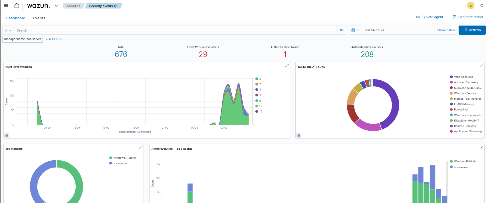
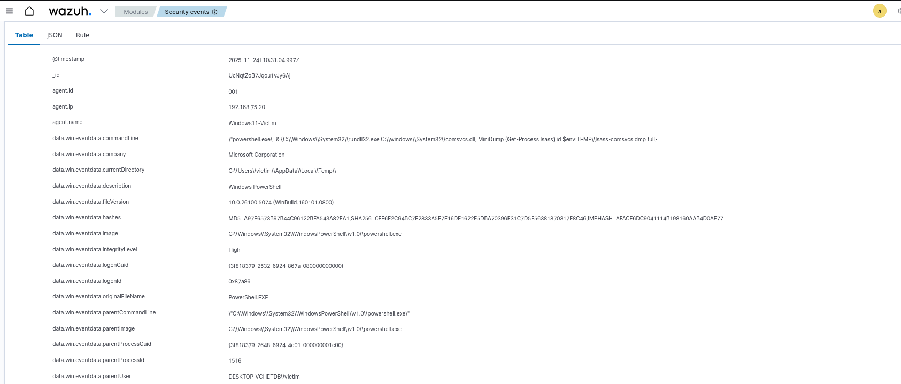
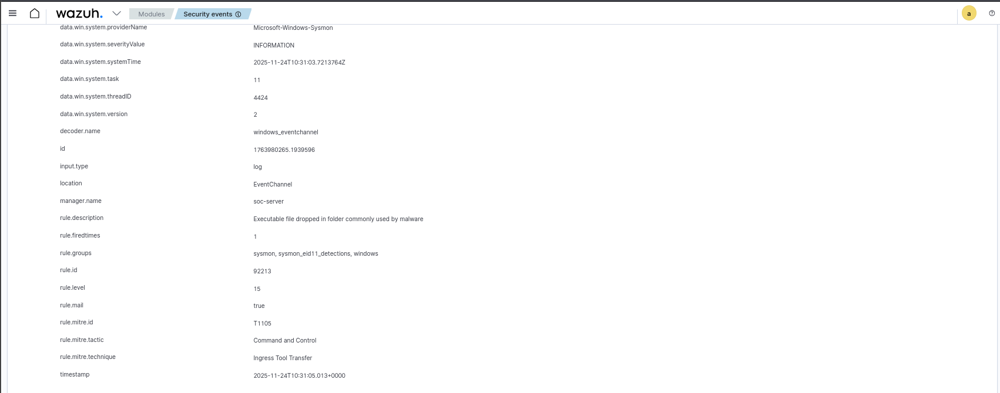
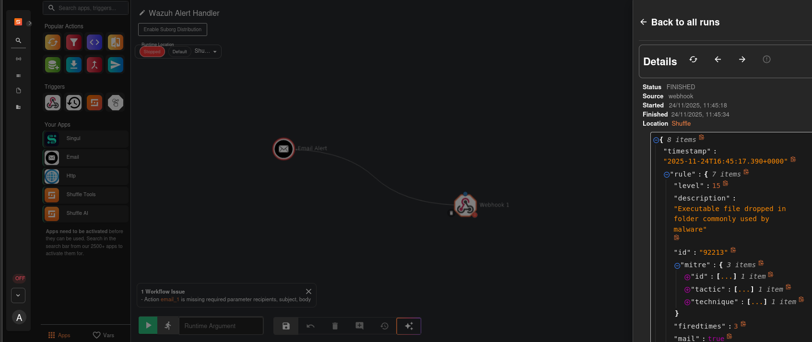

# 🛡️ Automated Threat Detection & Response Homelab

## 🚀 Project Overview
This project involves building a localized Security Operations Center (SOC) to simulate, detect, and respond to real-world cyberattacks. The goal was to engineer a detection pipeline that ingests raw endpoint telemetry and triggers high-fidelity alerts for "Living off the Land" (LotL) techniques.

**Objective:** Simulate a Credential Dumping attack (MITRE ATT&CK T1003.001) and detect it using custom SIEM logic and SOAR automation.

### 🛠️ Tech Stack
* **SIEM:** Wazuh (Manager & Dashboard)
* **Endpoint Telemetry:** Sysmon (Event ID 1, 10)
* **Attack Simulation:** Atomic Red Team (PowerShell)
* **SOAR:** Shuffle (Automation & Orchestration)
* **Environment:** VMware (Ubuntu Server + Windows 11 Endpoint)

---

## 🏗️ Architecture & Configuration
The lab consists of an isolated subnet connecting the SIEM server and the victim endpoint.

**1. Telemetry Configuration (Sysmon)**
Configured `sysmonconfig.xml` to capture Process Access (Event 10) targeting `lsass.exe`, bypassing default noise filtering.

**2. Custom Detection Rules (Wazuh)**
Engineered custom XML rules to detect the specific execution chain of `rundll32.exe` calling `comsvcs.dll`.
* *See `configs/local_rules.xml` for the source code.*

---

## ⚔️ Attack Simulation (Red Team)
**Technique:** MITRE T1003.001 (OS Credential Dumping: LSASS Memory)
**Tool:** Atomic Red Team

I executed a "Living off the Land" attack using legitimate Windows binaries to dump credential memory, a technique often used to evade standard antivirus signatures.

**Attack Command:**
```powershell
Invoke-AtomicTest T1003.001 -TestNumbers 2
# Payload: rundll32.exe C:\windows\System32\comsvcs.dll, MiniDump <lsass_pid> dump.dmp full
```

---

## 🛡️ Detection & Analysis (Blue Team)
The SIEM successfully correlated the PowerShell execution with the malicious command line arguments.

### 📸 Evidence of Detection
**1. Dashboard Overview:**
High-level view of the security posture showing the spike in Critical alerts.


**2. Forensic Analysis:**
Deep-dive into the alert showing the exact malicious command captured by the Wazuh agent.


**3. Critical Payload Detection:**
Detection of the dump file being dropped in the temp directory (Level 15 Alert).


---

## 🤖 Automated Response (SOAR)
To reduce alert fatigue and accelerate incident response, I integrated **Shuffle SOAR** to handle high-severity alerts automatically.

### 🔗 Integration Logic
* **Trigger:** Wazuh Manager detects a Critical Alert (Level 12+).
* **Action:** A custom Python integration script forwards the alert payload to a Shuffle Webhook.
* **Workflow:** Shuffle parses the JSON threat details (Rule ID, File Path) and prepares notification templates.

### 📸 Proof of Automation
Validation of the SOAR logic successfully parsing the Wazuh JSON payload.


---

## 🧠 Lessons Learned & Troubleshooting
* **Sysmon Tuning:** Standard configurations often filter out LSASS access to save performance. I learned to manually tune XML configs to balance visibility vs. noise.
* **Decoder Logic:** Overcame challenges with Wazuh decoders parsing nested JSON fields by implementing robust regex-based detection rules.
* **Pipeline Integrity:** Diagnosed and resolved network port conflicts (Docker vs Wazuh) to ensure reliable log shipping.

---
*Project created by [Your Name]*
